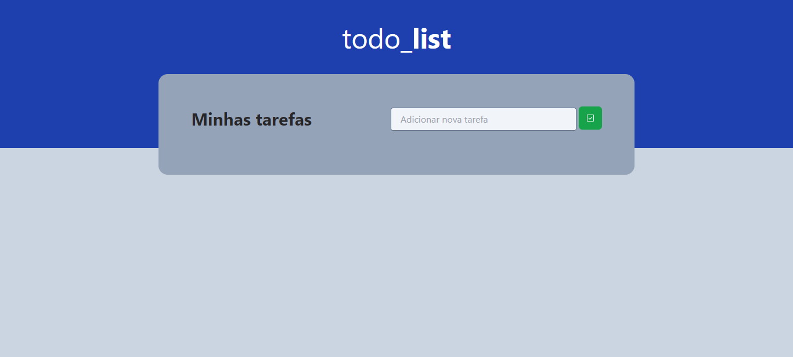

# todo_**list**

**Disponível em:** [todo**list**](todolist-coral-xi.vercel.app)

Projeto front-end para construção de uma lista de tarefas. Objetivo do projeto é desenvolver habilidades em; 

- React;

- Estados;

- Estilização com TailwindCSS;

## 🛠 Tecnologias

- React
- Typescript
- TailwindCSS

### ❗Ainda não está responsivo❗